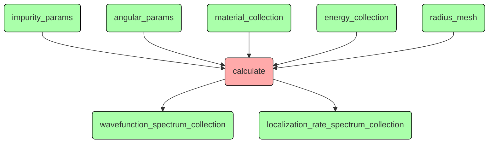
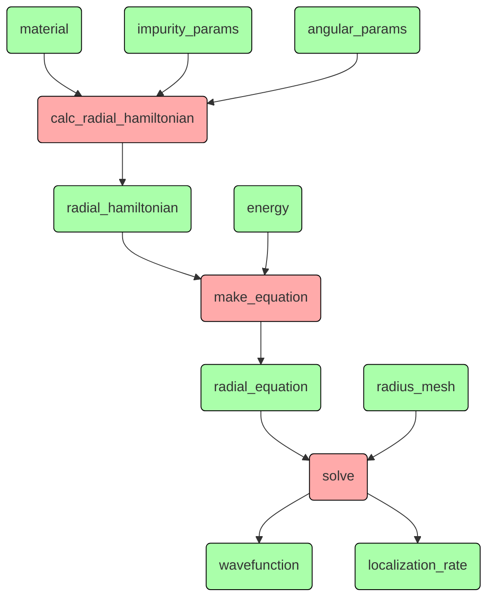
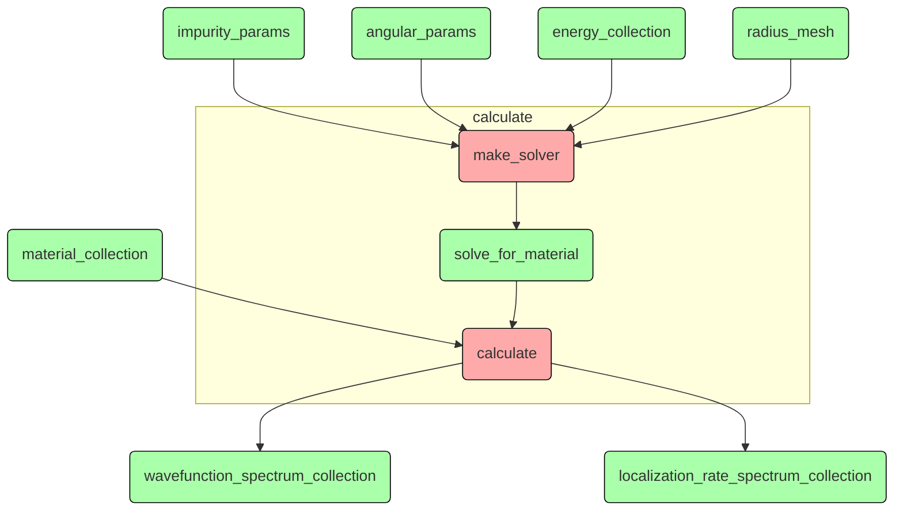
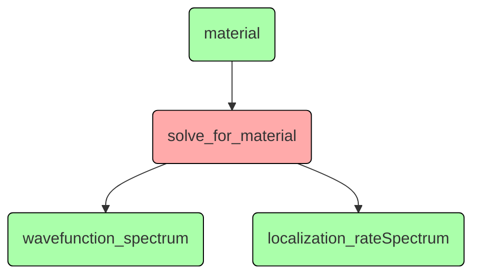
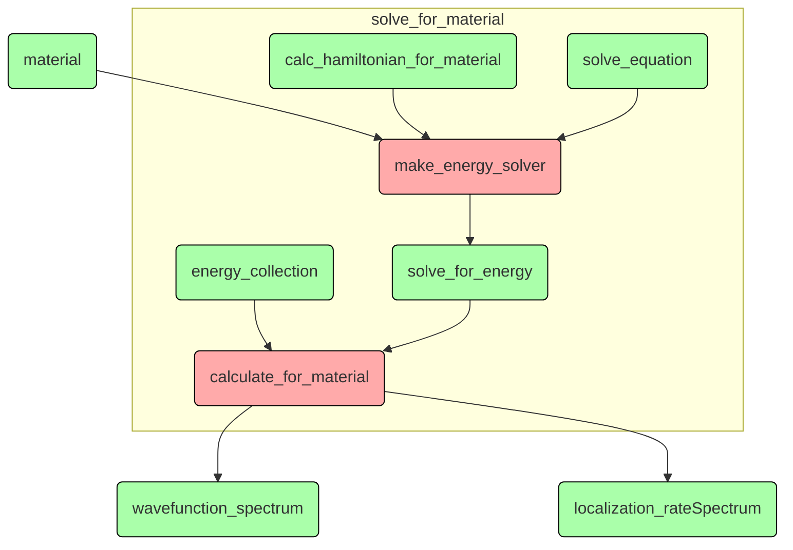
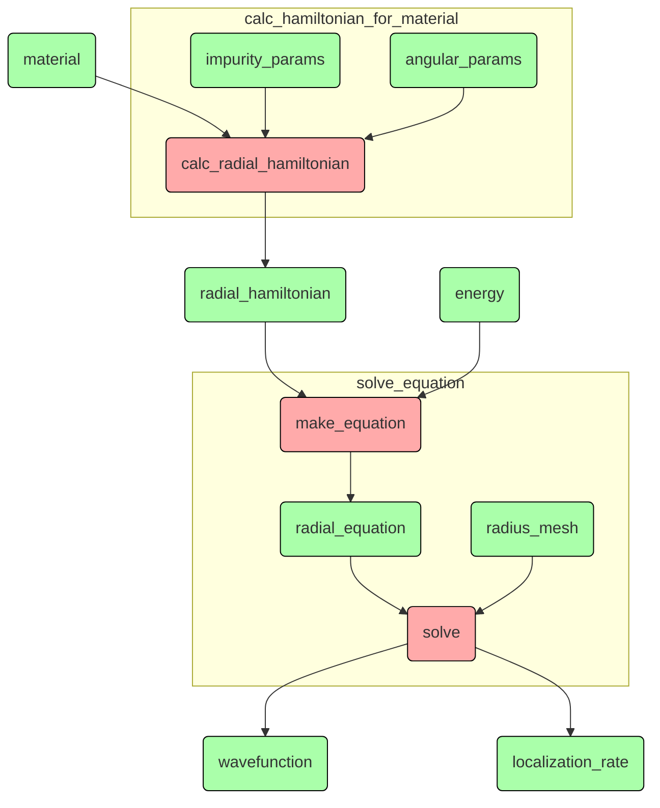
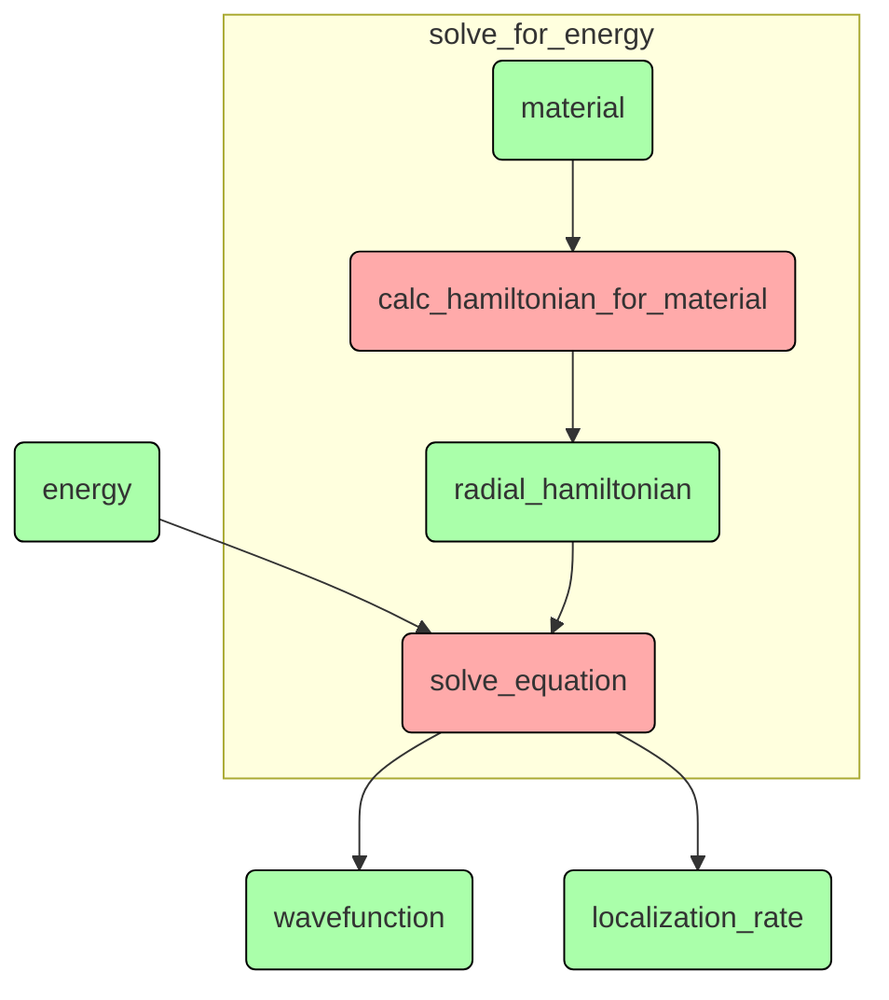

# Увидеть ясную структуру дизайна

## Что-то про квантовую механику - верхний уровень
```Python
...

def calc(params, energies, meshParams):
    r = solver.create_radial_mesh(meshParams)
    model = Hamiltonian(params)
    detQ = []
    for energy in energies:
        print(f"energy = {energy:6.2f}")
        detQ.append(np.linalg.det(solver.calc_localization_matrix(model, energy, meshParams)))
    detQ = np.array(detQ)
    return r, detQ, model.eg

for x in np.linspace(0, X_MAX, int(X_MAX / X_STEP + 0.1) + 1):
    params = SimpleNamespace(
        x = x,
        z = -1,
        j = args.j,
        l = args.l,
        t = 0,
        z1 = args.z1,
        l1 = args.l1,
    )
    with h5py.File(source_dir + fileName, "a") as f:
        key = paramKey(params)
        if key in f:
            print("exists", key)
            # calculation will be made only for missing energy values
            g = f[key]
            oldEnergies = g["energies"]
            calcEnergies = energies_meV[np.logical_not(
                np.isclose(energies_meV[:, np.newaxis], oldEnergies).any(1))]
            r, detQ, eg = calc(params, calcEnergies, meshParams)
            newEnergies = np.concatenate((oldEnergies, calcEnergies))
            s = np.argsort(newEnergies)
            newEnergies = newEnergies[s]
            newDetQ = np.concatenate((g["detQ"], detQ))[s]
            del g["energies"]
            del g["detQ"]
            g.create_dataset("energies", data=newEnergies)
            g.create_dataset("detQ", data=newDetQ)
            print()
        else:
            print("calculating", key)
            r, detQ, eg = calc(params, energies_meV, meshParams)
            print("creating", key)
            g = f.create_group(key)
            g.attrs["x"] = params.x
            g.attrs["z"] = params.z
            g.attrs["z1"] = params.z1
            g.attrs["l1"] = params.l1
            g.attrs["j"] = params.j
            g.attrs["l"] = params.l
            g.attrs["eg"] = eg
            g.create_dataset("energies", data=energies_meV)
            g.create_dataset("detQ", data=detQ)
            print()

...
```

Если абстрагироваться от нескольких вложенных циклов, вывода прогресса на экран и записи результата в файл,
то программа просто выполняет расчёты для заданного набора параметров и сохраняет результат:

Если бы нам нужен был только один материал и одна энергия, то логика расчёта выглядела бы так:

Её нужно отделить от работы с коллекциями параметров.

Вычисление энергетического спектра для фиксированного материала -
это отдельная физическая задача.
Вот пусть логика это и отражает:

где `solve_for_material` - это процедура решения задачи для одного материала:

Внутри этой процедуры мы снова отделяем логику расчёта от работы с коллекциями:

Процедуры `calc_hamiltonian_for_material` и `solve_equation` - это замыкания:

Процедура `make_energy_solver` собирает их вместе:

Поскольку замыкание `solve_for_energy` помнит `radial_hamiltonian`,
он не вычисляется повторно для каждой энергии.

Кстати, у разных материалов могут быть разные `energy_collection`,
потому что какие-то энергии уже могли быть записаны в файл.

Процедуры `calculate` и `calculate_for_material` просто применяют решатели
к элементам соответствующих коллекций и упаковывают результаты в новые коллекции.
У них одинаковая логика и её тоже можно выделить.