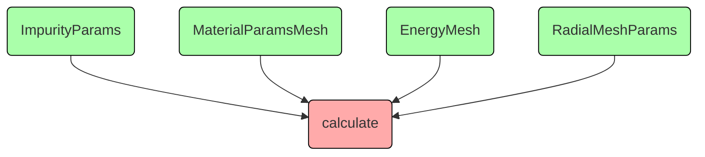

# Увидеть ясную структуру дизайна

```mermaid
graph TD;
    imp(ImpurityParams) --> calc(calculate)
    xm(MaterialParamsMesh) --> calc
    em(EnergyMesh) --> calc
    rm(RadialMeshParams) --> calc

    classDef proc fill:#faa, stroke:#000
    classDef data fill:#afa, stroke:#000
    class imp,xm,em,rm data
    class calc proc
```
