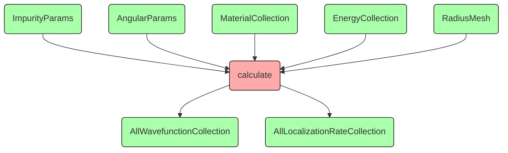
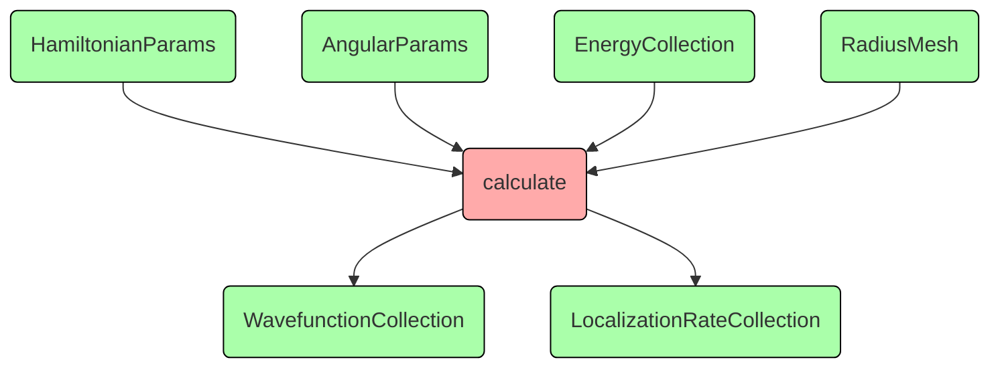
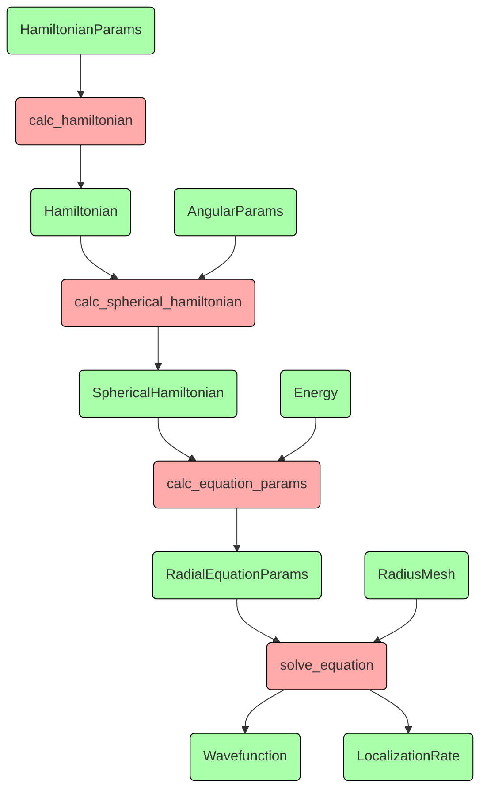

# Увидеть ясную структуру дизайна
Если абстрагироваться от нескольких вложенных циклов, вывода прогресса на экран и записи результата в файл,
то программа просто выполняет расчёты для занного набора параметров и сохраняет результат:

