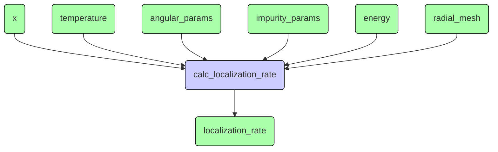
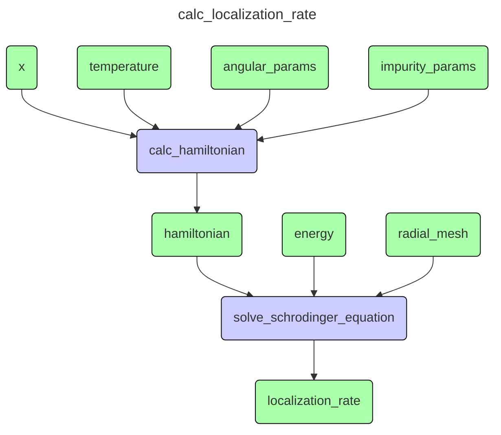
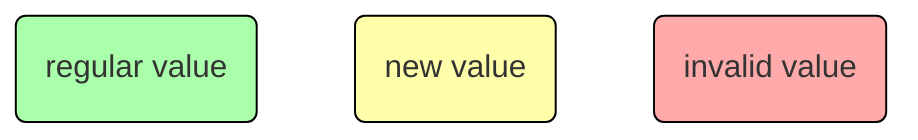
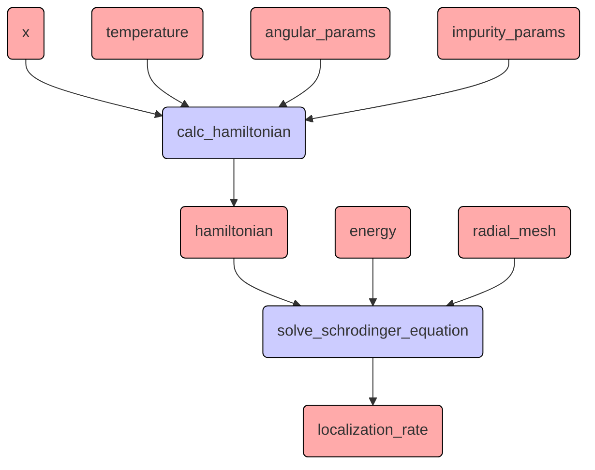
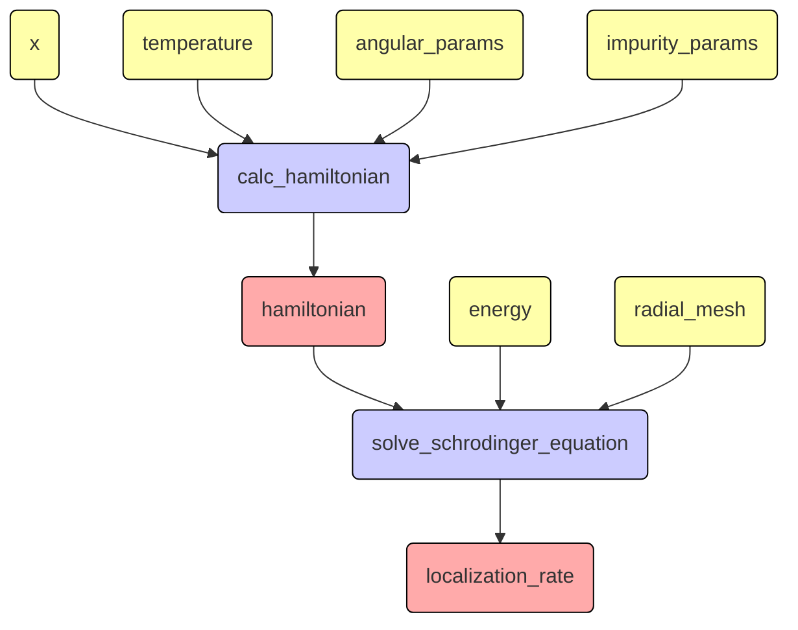
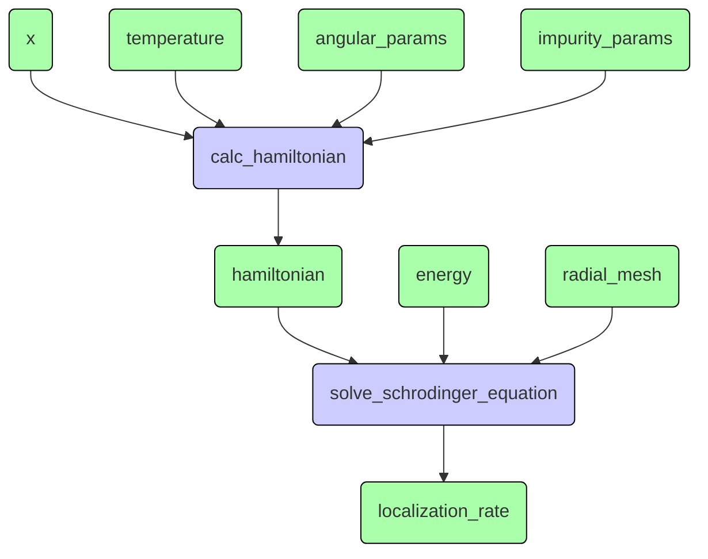
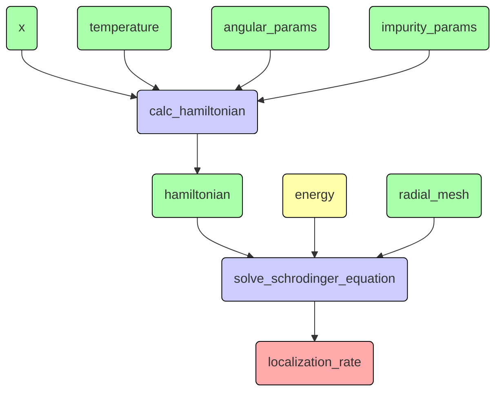
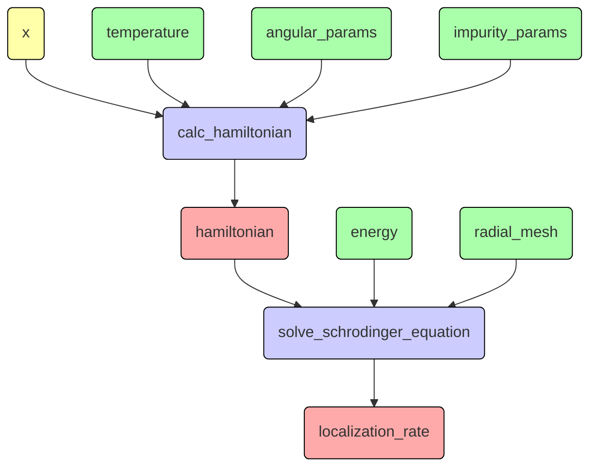

# Увидеть ясную структуру дизайна

Что-то про квантовую механику:
```Python
...

def calc(params, energies, meshParams):
    r = solver.create_radial_mesh(meshParams)
    model = Hamiltonian(params)
    detQ = []
    for energy in energies:
        print(f"energy = {energy:6.2f}")
        detQ.append(np.linalg.det(solver.calc_localization_matrix(model, energy, meshParams)))
    detQ = np.array(detQ)
    return r, detQ, model.eg

for x in np.linspace(0, X_MAX, int(X_MAX / X_STEP + 0.1) + 1):
    params = SimpleNamespace(
        x = x,
        z = -1,
        j = args.j,
        l = args.l,
        t = 0,
        z1 = args.z1,
        l1 = args.l1,
    )
    with h5py.File(source_dir + fileName, "a") as f:
        key = paramKey(params)
        if key in f:
            print("exists", key)
            # calculation will be made only for missing energy values
            g = f[key]
            oldEnergies = g["energies"]
            calcEnergies = energies_meV[np.logical_not(
                np.isclose(energies_meV[:, np.newaxis], oldEnergies).any(1))]
            r, detQ, eg = calc(params, calcEnergies, meshParams)
            newEnergies = np.concatenate((oldEnergies, calcEnergies))
            s = np.argsort(newEnergies)
            newEnergies = newEnergies[s]
            newDetQ = np.concatenate((g["detQ"], detQ))[s]
            del g["energies"]
            del g["detQ"]
            g.create_dataset("energies", data=newEnergies)
            g.create_dataset("detQ", data=newDetQ)
            print()
        else:
            print("calculating", key)
            r, detQ, eg = calc(params, energies_meV, meshParams)
            print("creating", key)
            g = f.create_group(key)
            g.attrs["x"] = params.x
            g.attrs["z"] = params.z
            g.attrs["z1"] = params.z1
            g.attrs["l1"] = params.l1
            g.attrs["j"] = params.j
            g.attrs["l"] = params.l
            g.attrs["eg"] = eg
            g.create_dataset("energies", data=energies_meV)
            g.create_dataset("detQ", data=detQ)
            print()

...
```

Этот код выполняет математические расчёты по следующей схеме:

Более подробно:

Можно пойти глубже, но пока хватит.

В данной программе меняются параметры `x` и `energy`,
но в других программах меняются другие параметры.

Важно, что есть схема расчёта и разные сценарии расчёта,
которые требуют разной реализации.
Нужно выделить схему расчёта явно и отделить её от сценария.

Декларативная модель в чистом виде здесь не очень хороша.
Нужно либо пересчитывать гамильтониан при изменении энергии (что не оптимально),
либо разбивать схему расчёта с помощью замыканий (тогда сценарий перемешается со схемой).

Нужно добавить к данным (зелёным узлам) состояние:

Тогда при расчётах будет следующая последовательность состояний:
1. Создана схема расчёта:

2. Заданы начальные значения

3. Первый раз "дёргаем" схему за `localization_rate` и происходят вычисления (ленивое dataflow поведение)

4. Меняем энергию

"Жёлтая" энергия "портит" `localization_rate` и всё, что от неё зависит.
Однако, теперь при обращении к `localization_rate`
не будет пересчитываться `hamiltonian`, так как он уже "зелёный",
и мы быстрее перейдём к состоянию 3.

5. Теперь меняем `x`

От этого "портится" и `hamiltonian` и `localization_rate`

## Что делать
Для реализации этой схемы потребуются АТД `ValueNode` и `ProcNode`.
Тип узла - это не про процедуры и значения (процедурным значением сейчас мало кого удивишь),
а про поведение в схеме расчёта.

Правила построения схемы расчёта:
- `ValueNode` может иметь максимум один вход от `ProcNode` и любое количество выходов;
- `ProcNode` может иметь любое количество входов и выходов;
- внутри `ProcNode` может быть своя вложенная схема расчёта.

Правила работы схемы расчёта:
- `ValueNode` может быть в одном из трёх состояний: `REGULAR`, `NEW`, `INVALID`;
- если `ValueNode` переходит в состояние `NEW` или `INVALID`,
то все зависящие от него `ValueNode` переходят в состояние `INVALID`;
- попытка прочитать значение из `ValueNode` в состоянии `INVALID` запускает `ProcNode`, от которого он зависит;
- при запуске `ProcNode` пытается прочитать значения из своих входных узлов;
- когда все `ProcNode`, зависящие от данного `ValueNode` были запущены,
он переходит в состояние `REGULAR`;
- запуск `ProcNode` переводит зависящие от него `ValueNode` в состояние `NEW`;

`ValueNode`
- конструктор
    - параметры: тип значения
        - постусловие: построение не завершено;
- команды:
    - привязать входной `ProcNode`;
        - предусловие: построение не завершено;
        - предусловие: узел не привязан к данному;
        - предусловие: нет входных узлов;
        - постусловие: узел привязан как входной;
    - привязать выходной `ProcNode`;
        - предусловие: построение не завершено;
        - предусловие: узел не привязан к данному;
        - постусловие: узел привязан как выходной;
    - завершить построение;
        - постусловие: построение завершено;
        - постусловие: состояние равно `INVALID`;
    - записать значение;
        - предусловие: построение завершено;
        - предусловие: допустимый тип значения;
        - постусловие: если есть выходные узлы - состояние равно `NEW`, иначе `REGULAR`;
        - постусловие: всем выходам отправлена команда об обновлении состояния входа;
    - перейти в состояние `INVALID`;
        - предусловие: построение завершено;
        - постусловие: состояние равно `INVALID`;
        - постусловие: если состояние изменилось, всем выходам отправлена команда об обновлении состояния входа;
    - сообщить что значение использовано в `ProcNode`;
        - предусловие: построение завершено;
        - предусловие: `ProcNode` привязан как выход;
        - предусловие: состояние не `INVALID`;
        - постусловие: если состояние `NEW`, и все `ProcNode` использовали значение,
                       состояние становится `REGULAR`;
    - подготовиться к чтению значения;
        - предусловие: построение завершено;
        - предусловие: есть входной `ProcNode` или состояние не `INVALID`;
        - постусловие: если состояние `INVALID`, входному `ProcNode` отправлена команда пересчитать значение;
        - постусловие: состояние не `INVALID`;
- запросы:
    - получить тип значения;
    - получить входной `ProcNode`;
    - получить список выходных `ProcNode`;
    - получить состояние;
        - предусловие: построение завершено;
    - получить значение;
        - предусловие: построение завершено;
        - предусловие: состояние не `INVALID`;

`ProcNode`
- конструктор
    - параметры: тип процедуры
        - постусловие: построение не завершено;
- команды:
    - привязать входной `ValueNode`;
        - предусловие: построение не завершено;
        - предусловие: узел не привязан к данному;
        - предусловие: имя узла не занято;
        - постусловие: узел привязан как входной под заданным именем;
    - привязать выходной `ValueNode`;
        - предусловие: построение не завершено;
        - предусловие: узел не привязан к данному;
        - предусловие: имя узла не занято;
        - постусловие: узел привязан как выходной под заданным именем;
    - завершить построение;
        - постусловие: процедура создана и ей переданы АТД `ProcInput` и `ProcOutput` (см. ниже);
        - постусловие: построение завершено;
    - обновить состояние входного значения (не требуется, если меняется на `REGULAR`);
        - предусловие: построение завершено;
        - постусловие: всем выходам отправлено сообщение о переходе в состояние `INVALID`;
    - пересчитать;
        - предусловие: построение завершено;
        - постусловие: всем входным `ValueNode` отправлена команда подготовки к чтению;
        - постусловие: всем входным `ValueNode` отправлено сообщение, что значение использовано;
        - постусловие: процедура выполнена;
        - постусловие: всем выходным `ValueNode` отправлена команда записи значения;
- запросы:
    - получить словарь входных `ValueNode`;
    - получить словарь выходных `ValueNode`;

Процедура - это АТД с конструктором, принимающим АТД `ProcInput` и `ProcOutput`,
и командой запуска:
- конструктор:
    - параметры: `ProcInput` и `ProcOutput`;
        - постусловие: процедура создана;
- команды:
    - запуск;
        - постусловие: результаты отправлены в `ProcOutput`;


АТД `ProcInput` и `ProcOutput` - интерфейсы,
позволяющие получать входные данные и отправлять выходные.

`ProcInput`
- запросы:
    - получить словарь входных `ValueNode`;
    - проверить присутствует ли имя в коллекции;
    - получить тип значения;
        - предусловие: имя значения присутствует в коллекции;
    - получить входное значение;
        - предусловие: имя значения присутствует в коллекции;

`ProcOutput`
- команды:
    - отправить выходное значение;
        - предусловие: построение завершено;
        - предусловие: имя значения присутствует в коллекции;
        - предусловие: тип значения допустимый;
        - постусловие: значение отправлено в узел;
- запросы:
    - получить словарь выходных `ValueNode`;
    - проверить присутствует ли имя в коллекции;
    - получить тип значения;
        - предусловие: имя значения присутствует в коллекции;

Сам узел использует расширенные версии:

`ProcNodeInput` - наследник `ProcInput`
- конструктор:
    - без параметров;
        - постусловие: создана пустая коллекция;
- команды:
    - добавить имя и входной узел;
        - предусловие: узел отсутствует в коллекции;
        - предусловие: имя отсутствует в коллекции;
        - постусловие: имя и тип добавлены в коллекцию;
- запросы:
    - проверить входит ли узел в коллекцию;

`ProcNodeOutput` - наследник `ProcOutput`
- конструктор:
    - без параметров;
        - постусловие: создана пустая коллекция;
- команды:
    - добавить имя и выходной узел;
        - предусловие: построение не завершено;
        - предусловие: узел отсутствует в коллекции;
        - предусловие: имя отсутствует в коллекции;
        - постусловие: имя и узел добавлены в коллекцию;
    - завершить построение;
        - постусловие: построение завершено;
    - сбросить учёт отправки выходных значений;
        - предусловие: построение завершено;
- запросы:
    - проверить входит ли узел в коллекцию;
    - проверить полноту отправки выходных значений;
        - предусловие: построение завершено;