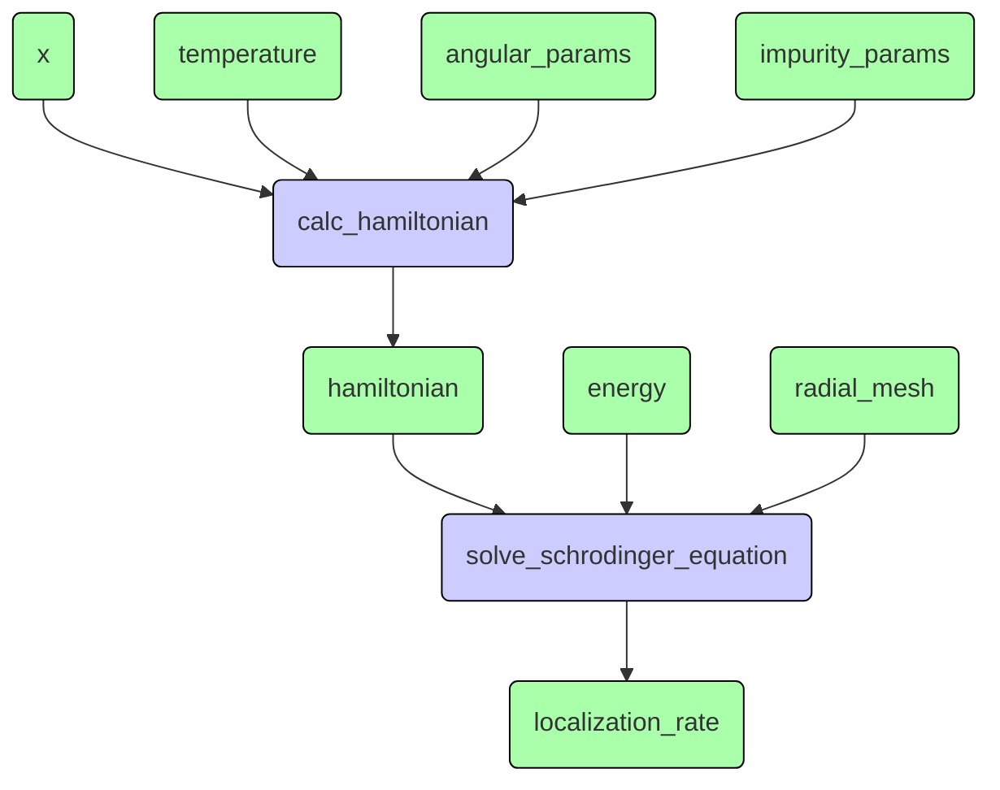
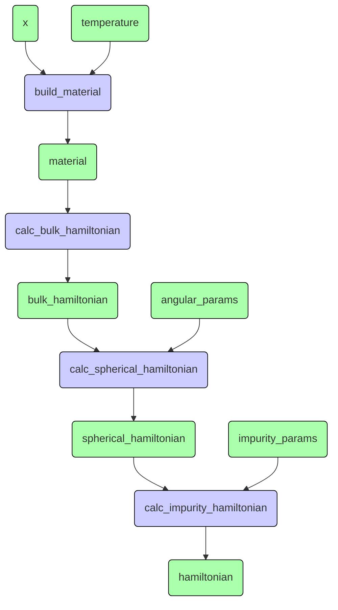
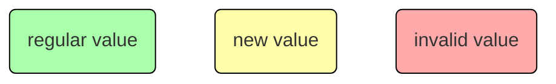
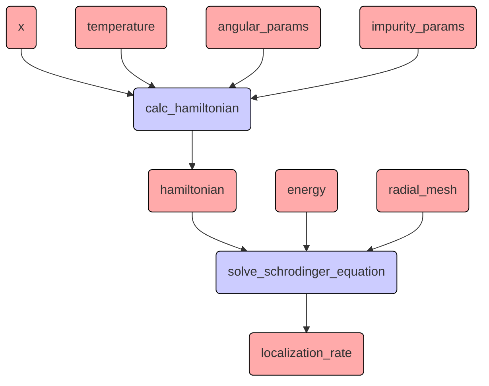
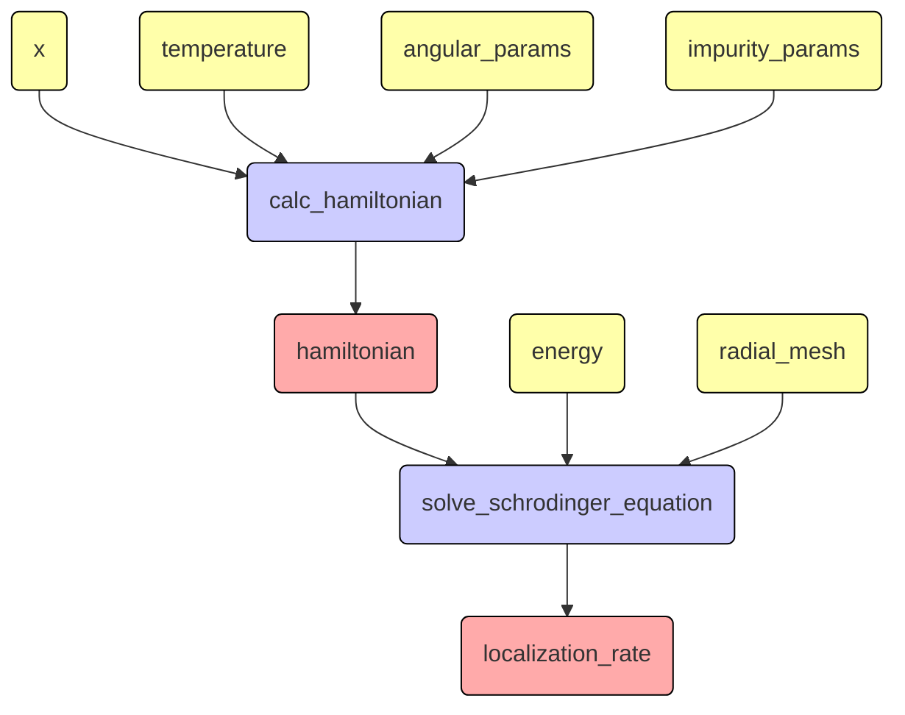
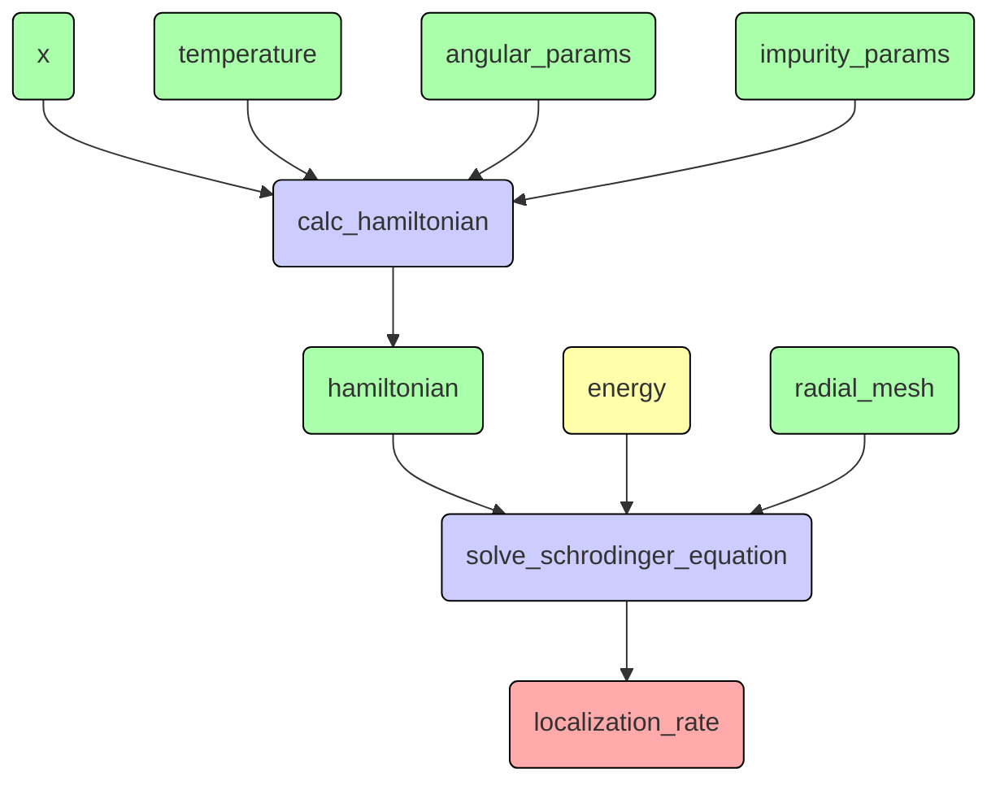
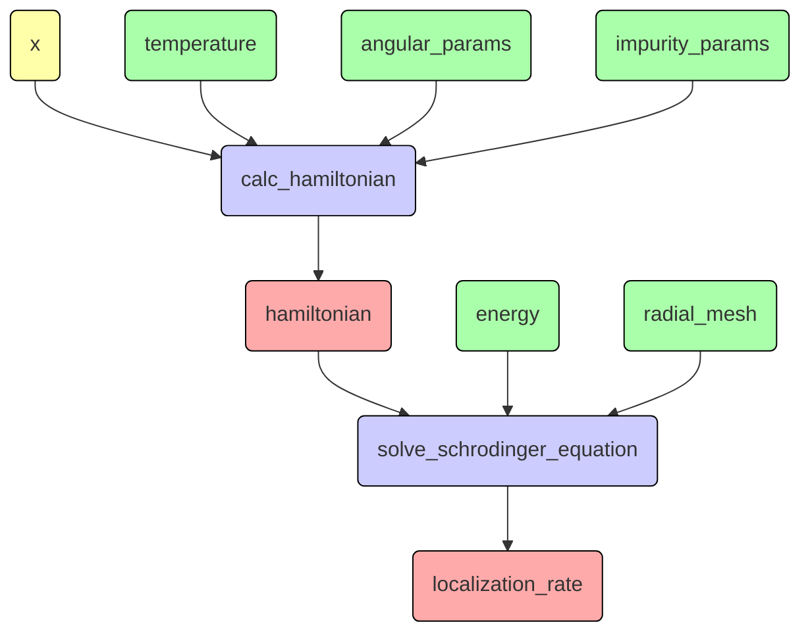
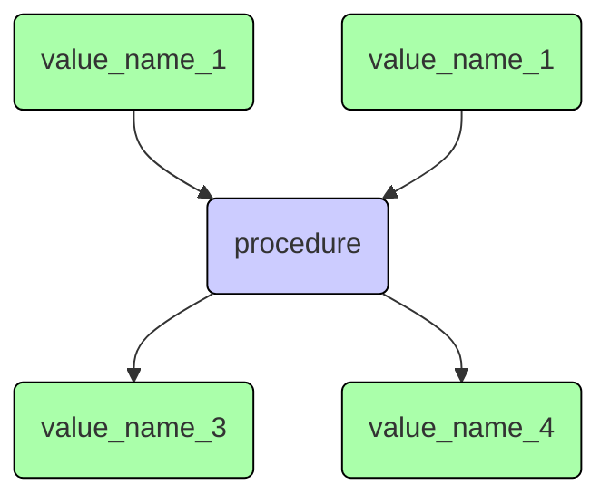

# Увидеть ясную структуру дизайна

Что-то про квантовую механику:
```Python
...

def calc(params, energies, meshParams):
    r = solver.create_radial_mesh(meshParams)
    model = Hamiltonian(params)
    detQ = []
    for energy in energies:
        print(f"energy = {energy:6.2f}")
        detQ.append(np.linalg.det(solver.calc_localization_matrix(model, energy, meshParams)))
    detQ = np.array(detQ)
    return r, detQ, model.eg

for x in np.linspace(0, X_MAX, int(X_MAX / X_STEP + 0.1) + 1):
    params = SimpleNamespace(
        x = x,
        z = -1,
        j = args.j,
        l = args.l,
        t = 0,
        z1 = args.z1,
        l1 = args.l1,
    )
    with h5py.File(source_dir + fileName, "a") as f:
        key = paramKey(params)
        if key in f:
            print("exists", key)
            # calculation will be made only for missing energy values
            g = f[key]
            oldEnergies = g["energies"]
            calcEnergies = energies_meV[np.logical_not(
                np.isclose(energies_meV[:, np.newaxis], oldEnergies).any(1))]
            r, detQ, eg = calc(params, calcEnergies, meshParams)
            newEnergies = np.concatenate((oldEnergies, calcEnergies))
            s = np.argsort(newEnergies)
            newEnergies = newEnergies[s]
            newDetQ = np.concatenate((g["detQ"], detQ))[s]
            del g["energies"]
            del g["detQ"]
            g.create_dataset("energies", data=newEnergies)
            g.create_dataset("detQ", data=newDetQ)
            print()
        else:
            print("calculating", key)
            r, detQ, eg = calc(params, energies_meV, meshParams)
            print("creating", key)
            g = f.create_group(key)
            g.attrs["x"] = params.x
            g.attrs["z"] = params.z
            g.attrs["z1"] = params.z1
            g.attrs["l1"] = params.l1
            g.attrs["j"] = params.j
            g.attrs["l"] = params.l
            g.attrs["eg"] = eg
            g.create_dataset("energies", data=energies_meV)
            g.create_dataset("detQ", data=detQ)
            print()

...
```

## Схема расчёта
Этот код выполняет математические расчёты по следующей схеме:

Внутри синих блоков схема аналогичная: узлы-значения и узлы-процедуры, например:


В данной программе меняются параметры `x` и `energy`,
но в других программах меняются другие параметры.

Важно, что есть схема расчёта и разные сценарии расчёта,
которые требуют разной реализации.
Нужно выделить схему расчёта явно и отделить её от сценария.

Декларативная модель в чистом виде здесь не очень подходит.
Придётся либо пересчитывать гамильтониан при изменении энергии (что не оптимально),
либо разбивать схему расчёта с помощью замыканий (тогда сценарий перемешается со схемой).

Нужно добавить к значениям (зелёным узлам) состояние:

Тогда при расчётах будет следующая последовательность состояний:
1. Создана схема расчёта:

2. Заданы начальные значения

3. Первый раз "дёргаем" схему за `localization_rate` и происходят вычисления (ленивое dataflow поведение)

4. Меняем энергию

"Жёлтая" энергия "портит" `localization_rate` и всё, что от неё зависит.
Однако, теперь при обращении к `localization_rate`
не будет пересчитываться `hamiltonian`, так как он уже "зелёный",
и мы быстрее перейдём к состоянию 3.

5. Теперь меняем `x`

От этого "портится" и `hamiltonian` и `localization_rate`,
и теперь нужно всё пересчитывать.


## Реализация схемы расчёта
Для реализации этой схемы потребуются АТД узел-значение и узел-процедура.

Правила построения схемы расчёта:
- процедуры могут соединяться только со значениями, а значения - с процедурами;
- все соединения имеют строго одно направление;
- значение может иметь максимум одну входную процедуру и любое количество выходных;
- процедура может иметь любое количество входных и выходных значений;

Внутри процедуры может быть вложена своя схема расчёта, что позволяет
легко разбивать задачу на подзадачи.

Условие, что значение зависит ровно от одной процедуры позволяет всегда определить
"ответственного" за его обновление.

У узлов есть два основных состояния:
- построение не завершено
    - можно привязывать входы и выходы;
    - нельзя задавать и читать значения;
    - нельзя запускать процедуры;
- построение завершено
    - нельзя привязывать входы и выходы;
    - можно задавать и читать значения;
    - можно запускать процедуры;

Значение, для которого построение завершено, может быть в одном из трёх состояний:
- `INVALID` - значение не задано, или устарело;
- `NEW` - значение обновлено и ещё учтено не во всех зависящих от него процедурах;
- `REGULAR` - значение задано и учтено во всех зависящих от него процедурах;

Если значение становится `NEW` или `INVALID`, то все зависящие от него процедуры
получают команду `invalidate`.
Затем они транслируют её своим выходным значениями и процесс продолжается,
пока не будет достигнут конец схемы.

Перед чтением значения нужно вызвать команду `validate`, которая транслируется
уже в обратном направлении, запуская все нужные процедуры.

После успешного выполнения процедура переводит свои выходные значения
в состояние `NEW`.
Когда все выходные процедуры прочитают это значение, оно станет `REGULAR`.

Если для краткости опустить реализацию и статусы,
то АТД узлов в программе выглядят так:
```python
@final
class ValueNode:

    # CONSTRUCTOR
    def __init__(self, value_type: type) -> None:
        ...

    # COMMANDS

    # add input node
    # PRE: building not complete
    # PRE: node not linked to this
    # PRE: this node has no inputs
    # POST: node linked as input to this
    def add_input(self, input: "ProcedureNode") -> None:
        ...

    # add outinput node
    # PRE: building not complete
    # PRE: node not linked to this
    # POST: node linked as output to this
    def add_output(self, output: "ProcedureNode") -> None:
        ...

    # complete build
    # POST: build complete
    # POST: state is INVALID
    def complete_build(self) -> None:
        ...

    # put value
    # PRE: build complete
    # PRE: value of proper type
    # POST: value is set
    # POST: if there are outputs then state is NEW else REGULAR
    # POST: all outputs get invalidate command
    def put(self, value: Any) -> None:
        ...

    # set state to INVALID
    # PRE: build complete
    # POST: state is INVALID
    # POST: if the state has changed then all outputs get invalidate command
    def invalidate(self) -> None:
        ...

    # notify that the value was used by output
    # PRE: build complete
    # PRE: output is linked
    # PRE: not in INVALID state
    # POST: if state is NEW and all outputs used value then set state to REGULAR
    def used_by(self, output: "ProcedureNode") -> None:
        ...

    # ensure that the value is valid
    # PRE: build complete
    # PRE: there is input or the state is not INVALID
    # POST: if the state is INVALID then the input gets run command
    def validate(self) -> None:
        ...


    # QUERIES

    # get value type
    def get_type(self) -> type:
        ...

    # get input node
    def get_input(self) -> Optional["ProcedureNode"]:
        ...

    # get set of output nodes
    def get_outputs(self) -> set["ProcedureNode"]:
        ...

    class State(Enum):
        INVALID = auto(),
        NEW = auto(),
        REGULAR = auto(),

    # get node state
    # PRE: build complete
    def get_state(self) -> State:
        ...

    # get value
    # PRE: build complete
    # PRE: state is not INVALID
    def get(self) -> Any:
        ...
```

```python
@final
class ProcedureNode:

    # CONSTRUCTOR
    def __init__(self, procedure: Procedure) -> None:
        ...

    # COMMANDS

    # add input node
    # PRE: building not complete
    # PRE: node not linked to this
    # POST: node linked as input to this
    def add_input(self, name: str, input: ValueNode) -> None:
        ...

    # add output node
    # PRE: building not complete
    # PRE: node not linked to this
    # POST: node linked as output to this
    def add_output(self, name: str, output: ValueNode) -> None:
        ...

    # complete build
    # POST: procedure initialized
    # POST: build complete
    def complete_build(self) -> None:
        ...

    # signal that input state changed to NEW or INVALID
    # PRE: build complete
    # POST: all outputs get invalidate command
    def invalidate(self) -> None:
        ...

    # run the procedure
    # PRE: build complete
    # PRE: inputs can be validated
    # PRE: inputs and outputs compatible with the procedure
    # POST: all inputs have been validated
    # POST: the procedure have been run
    # POST: all outputs have been updated
    def validate(self) -> None:
        ...


    # QUERIES

    # get dictionary of input nodes
    def get_inputs(self) -> dict[str, "ValueNode"]:
        ...

    # get dictionary of output nodes
    def get_outputs(self) -> dict[str, "ValueNode"]:
        ...
```

Задача управления схемой расчёта разбита на маленькие подзадачи управления
отдельными узлами.

Процедура - это абстрактный класс:
```python
class Procedure(ABC):

    # COMMANDS
    
    # set input value
    # PRE: name is acceptable
    # PRE: value type is compatible
    # POST: input value is set
    @abstractmethod
    def put(self, name: str, value: Any) -> None:
        pass


    # QUERIES

    # get value
    # PRE: name is acceptable
    # PRE: there is enough data to calculate value
    @abstractmethod
    def get(self, name: str) -> Any:
        pass
```

Технически, именно запрос `get` меняет внутреннее состояние процедуры,
запуская вычисления.
Но с точки зрения логики, состояние изменяется командой `put`,
а то, что вычисления "ленивые" - это уже детали реализации.

## Декларативное описание схемы расчёта
Самое вкусное здесь - это АТД и `Simulator`, который является потомком процедуры:
```python
ValueLink = Union[str, type]
ValuePattern = tuple[str, type]
ProcPattern = tuple[Procedure, dict[str, ValueLink], dict[str, ValueLink]]
NodePattern = Union[ValuePattern, ProcPattern]

class Simulator(Procedure):

    # CONSTRUCTOR
    # PRE: patterns have no duplicate names
    # PRE: all procedure IO names present in value patterns
    # PRE: no duplicate links
    # PRE: no multiple value inputs
    # POST: nodes linked and build complete for all nodes
    def __init__(self, node_patterns: list[NodePattern]) -> None:
        ...

    # COMMANDS

    @final
    def put(self, name: str, value: Any) -> None:
        ...

    # QUERIES

    @final
    def get(self, name: str) -> Any:
        ...
```

Данный АТД берёт на себя построение схемы расчёта на основе входных
данных конструктора:
```python
simulator = Simulator([
    ("value_name_1", Type1),
    ("value_name_2", Type2),
    (procedure,
        {"input_1": "value_name_1", "input_2": "value_name_1"},
        {"output_1": "value_name_3", "output_2": "value_name_4"}),
    ("value_name_3", Type3),
    ("value_name_4", Type4),
])
```


Поскольку симулятор - это тоже процедура, то можно вкладывать схемы расчёта
друг в друга:

```python
hamiltonian_calculator = Simulator([
    (MaterialBuilder(),
        {"x": float, "temperature": float},
        {"material": Material}),
    (BulkHamiltonianCalculator(),
        {"material": Material},
        {"hamiltonian": "bulk_hamiltonian"}),
    ("bulk_hamiltonian", BulkHamiltonian),
    (SphericalHamiltonianCalculator(),
        {
            "bulk_hamiltonian": "bulk_hamiltonian",
            "angular_params": AngularParams,
        },
        {"spherical_hamiltonian": "spherical_hamiltonian"}),
    ("spherical_hamiltonian", SphericalBulkHamiltonian),
    (ImpurityHamiltonianCalculator(),
        {
            "bulk_hamiltonian": "spherical_hamiltonian",
            "impurity_params": ImpurityParams,
        },
        {"impurity_hamiltonian": "hamiltonian"}),
    ("hamiltonian", ImpuritySphericalHamiltonian)
])

simulator = Simulator([
    (hamiltonian_calculator,
        {
            "x": float,
            "temperature": float,
            "angular_params": AngularParams,
            "impurity_params": ImpurityParams,
        },
        {
            "hamiltonian": Hamiltonian,
        }),
    (SchrodingerEquationSolver(),
        {
            "hamiltonian": Hamiltonian,
            "energy": float,
            "radial_mesh": MeshParams,
        },
        {
            "localization_rate": float,
        }),
])
```
Для некоторых процедур у входов и выходов указывается не имя, а тип,
тогда узел-значение создаётся автоматически.

Используется симулятор примерно так:
```python
...
# constant parameters
simulator.put("temperature", temperature_kelvin)
simulator.put("angular_params", angular_params)
simulator.put("impurity_params", impurity_params)
simulator.put("radial_mesh", radial_mesh)

storage = SpectraStorage("file_name.hdf5")
for x in x_mesh:
    simulator.put("x", x)
    spectrum = Spectrum()
    for energy in energy_mesh:
        simulator.put("energy", energy)
        spectrum.put(energy, simulator.get("localization_rate"))
    storage.put(x, spectrum)
```


## Выводы
Лет 10 хотел сделать такую схему, и даже пытался, но всегда запутывался.

Основные ошибки были следующие:
- отсутствие разделения команд и запросов,
  из-за чего создавались сложные методы, в которых я запутывался;
- отсутствие ограничения на изменения входных данных методов,
  из-за чего, например, методы связывания узлов "лазили" в соседние узлы
  и меняли их состояние, что опять всё запутывало;
  теперь связывание выполняется двумя командами:
  ```python
  value.add_output(procedure)
  procedure.add_input("source", value)
  ```
- желание собрать логику работы схемы расчёта в одно месте,
  вместо разделения на подзадачи и "раздачи" подзадач разным АТД,
  из-за чего для схемы расчёта нужен был специальный "умный" контейнер со сложными алгоритмами;
- незнание принципов декларативной вычислительной модели и попытки реализовать
  циклы через dataflow - это был очень нетривиальный алгоритм с поиском
  сильно связанных компонент в графе, там тоже было где запутаться;
- отсутствие "волшебной таблетки мотивации" hard work.

Благодаря курсам по вычислительным моделям и ООП, наконец удалось реализовать
эту логику через АТД.

С непривычки потребовалось несколько раз переделывать логику и переписывать код.

Теперь можно постепенно "разгрызать" мои старые расчётные программы,
выделяя АТД для узлов-значений и упаковывая расчёты в процедуры.
Процедуры можно разбивать на более мелкие с возможностью повторного использования.

Самое вкусное: поскольку теперь нет "умных" контейнеров и логика реализована,
фактически, через обмен сообщениями, можно превратить некоторые узлы-значения
в узлы-очереди-сообщений.
Часть схемы будет в одном потоке, а часть - в другом.

Можно масштабировать расчёты даже для суперкомпьютера.
Самое главное, для этого не нужно менять схему расчёта, просто нужен
класс-потомок для класса `Simulator` и несколько настроек к нему.
